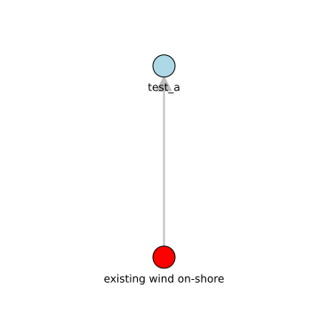
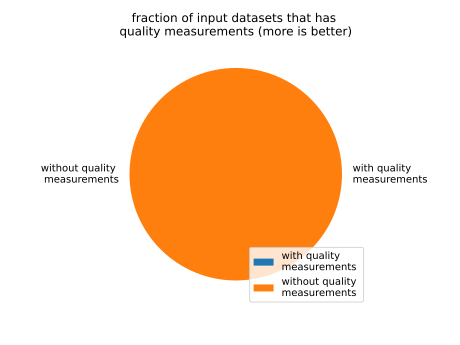

existing wind on-shore
======================

# description
  
Data set contains data on capacity factors of on-shore wind across different GIS regions as a time series since 1980 to 2022 on hourly basis
## Publisher

|||
| :--- | :--- |
|Publisher|SimpleMDDataCatalog|
|Contact|info@mopo.eu|
|license|cc-by 4.0|

## About the data

|||
| :--- | :--- |
|last modified|2024-10-21|
|spatial cover|Europe|
|temporal cover|1980 - 2020|
|version|0.4|
|status|first version|

## Data Quality

|metric|value|time of evaluation|dimension|
| :---: | :---: | :---: | :---: |
|[all countries present](jkdsfAFdfgsdfg.md)|1.0|2024-10-21T15:01:34+0000|https://iso25000.com/index.php/en/iso-25000-standards/iso-25012/Completeness|

## Data lineage

|was derived from|
| :--- |
|https://datacatalog.github.io/test_this#test_a: No additional information this dataset was provided.|
  

## supply chain analysis
  

## Distributions

|identifier|format|version|last modified|access url|
| :---: | :---: | :---: | :---: | :---: |
|skfhafuku|csv|0.4|2022-05-02|[https://data.dtu.dk/ndownloader/files/34972672](https://data.dtu.dk/ndownloader/files/34972672)|
