# TagGenerator - Django QR Code Generator 💫📱

[](https://pypi.org/project/django-qrcode/) 
[](https://www.python.org/) 
[](https://www.djangoproject.com/) 
[](LICENSE) 
[](https://github.com/DadaNanjesha/tag-generator/releases) 
[](https://github.com/DadaNanjesha/TagGenerator/actions/workflows/django.yml?query=branch%3Amain)
[](https://github.com/DadaNanjesha/TagGenerator/actions/workflows/python-publish.yml?query=branch%3Amain)
[](https://github.com/DadaNanjesha/TagGenerator/actions/workflows/publish-docker.yml?query=branch%3Amain)

_TagGenerator is a sleek, reusable Django app for generating stylish, customizable QR codes on the fly. Easily integrate it into your web applications and give your project that extra visual flair!_

---

## 📖 Table of Contents

- [Overview](#overview)
- [Key Features](#key-features)
- [Flow Diagram](#flow-diagram)
- [Project Structure](#project-structure)
- [Installation](#installation)
- [Usage](#usage)
- [Deployments](#deployments)
- [Releases & Packages](#releases--packages)
- [Contributing](#contributing)
- [License](#license)
- [Acknowledgements](#acknowledgements)

---

## 🔍 Overview

In today’s fast-paced digital world, QR codes serve as an essential bridge between offline and online experiences. **TagGenerator** delivers a dynamic, stylish QR code generation solution for Django projects. With advanced styling options like rounded modules and radial gradients, you can create QR codes that are both functional and visually appealing.

---

## ✨ Key Features

- **⚡ Dynamic Generation:** Create QR codes in real time for any URL or text.
- **🎨 Advanced Styling:** Customize QR codes with rounded modules, gradient colors, and more.
- **🔌 Reusable Django App:** Seamlessly plug into any Django project with minimal setup.
- **📠Custom Template Tag:** Easily render QR codes in templates using ``.
- **🐳 Docker Ready:** Simplify deployments with a pre-built Docker image.
- **🛠️ CI/CD Integration:** Automated testing and releases with GitHub Actions.

---

## 🔄 Flow Diagram

```mermaid
flowchart TD
    A[📥 Input: Text or URL] --> B[🔧 QR Code Generation]
    B --> C[🎨 Apply Styling Options]
    C --> D[📤 Output: Styled QR Code Image]
    D --> E[🖥️ Embed in Django Templates]
```



---

## 🗂️ Project Structure

```plaintext
TagGenerator/
├── .github/                  # GitHub Actions workflows for CI/CD 🚀
├── Dockerfile                # Docker configuration for containerized deployment 🐳
├── QrCode/                   # Reusable Django app for QR code generation
│   ├── migrations/           # Database migrations
│   ├── templates/            # Django templates (includes custom tag usage)
│   ├── templatetags/         # Custom template tags (e.g., qrcode_tags.py) 🏷️
│   ├── urls.py               # URL configuration for the QRCode app
│   └── views.py              # Views to render QR codes
├── TagGenerator/             # Main Django project directory
│   ├── settings.py           # Project settings (including app configurations)
│   ├── urls.py               # Root URL configurations
│   └── wsgi.py               # WSGI configuration for deployment
├── manage.py                 # Django project management script
├── requirements.txt          # Python dependencies 📦
├── setup.py                  # Setup script for packaging and PyPI publishing
├── LICENSE                   # MIT License
└── README.md                 # Project documentation (this file) 📖
```

---

## 💻 Installation

### From PyPI

Install the package directly via pip:

```bash
pip install TagGenerator
```

### Manual Setup

1. **Clone the Repository:**

   ```bash
   git clone https://github.com/DadaNanjesha/tag-generator.git
   cd tag-generator
   ```

2. **Set Up a Virtual Environment:**

   ```bash
   python -m venv venv
   source venv/bin/activate  # Windows: venv\Scripts\activate
   ```

3. **Install Dependencies:**

   ```bash
   pip install -r requirements.txt
   ```

4. **Install in Editable Mode (for development):**

   ```bash
   pip install -e .
   ```

---

## 🚀 Usage

### Integrate into Your Django Project

1. **Add to Installed Apps:**  
   In your `settings.py`:

   ```python
   INSTALLED_APPS = [
       # ... other apps
       "QrCode",
   ]
   ```

2. **Include URL Configuration:**  
   Update your project's `urls.py`:

   ```python
   from django.urls import include, path

   urlpatterns = [
       # ... other URL patterns
       path("qrcode/", include("QrCode.urls", namespace="qrcode")),
   ]
   ```

3. **Embed QR Code in Templates:**  
   Load the custom template tag and render a QR code:

   ```django
   
   
   ```

4. **Demo:**  
   Access the demo at `http://<your-domain>/qrcode/` to see your QR code in action.

---

## 🐳 Deployments

### Docker Deployment

Use Docker for a consistent environment:

1. **Build the Docker Image:**

   ```bash
   docker build -t dadananjesha/tag-generator .
   ```

2. **Run the Docker Container:**

   ```bash
   docker run -d -p 8000:8000 dadananjesha/tag-generator
   ```

Visit `http://localhost:8000/qrcode/` to view your app.

### CI/CD

TagGenerator leverages GitHub Actions for continuous integration. Check out the workflows in the [`.github/workflows`](.github/workflows) directory for more details.

---

## 🏷️ Releases & Packages

- **Releases:**  
  The latest release is [v1.0.2](https://github.com/DadaNanjesha/tag-generator/releases/tag/v1.0.2) (Mar 8, 2025). Each release includes detailed notes on fixes and new features.

- **Packages:**  
  TagGenerator is available on [PyPI](https://pypi.org/project/django-qrcode/). We follow Semantic Versioning to ensure stability.

- **Publishing Workflow:**  
  To release a new version:
  1. **Tag the Release:**
     ```bash
     git tag vX.Y.Z
     git push --tags
     ```
  2. **Build the Distribution:**
     ```bash
     python setup.py sdist bdist_wheel
     ```
  3. **Upload with Twine:**
     ```bash
     twine upload dist/*
     ```

---

## 🤝 Contributing

Contributions are welcome! Here’s how you can help:

1. **Fork the Repository**
2. **Create a Feature Branch:**
   ```bash
   git checkout -b feature/your-feature-name
   ```
3. **Commit Your Changes:**  
   Write clear, descriptive commit messages.
4. **Push and Submit a Pull Request:**  
   Please open an issue first for major changes.

---

## ⭐️ Support & Call-to-Action

If you find this project useful, please consider:
- **Starring** the repository ⭐️
- **Forking** the project to contribute enhancements
- **Following** for updates on future improvements

Your engagement helps increase visibility and encourages further collaboration!

---

## 📜 License

This project is licensed under the [MIT License](LICENSE).

---

## 🙏 Acknowledgements

- **Built With:** Django, Python, and the qrcode library.
- **Inspiration:** Designed to provide an elegant and customizable QR code solution.
- **CI/CD:** Thanks to GitHub Actions for seamless integration and deployment.

---

*Happy coding and may your QR codes always be stylish! 🚀✨*
