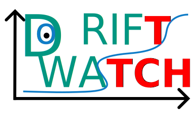

# Drift Monitoring Detector

## Description

Drift Monitoring Detector is a Python client for monitoring concept and data drift in machine learning models. It provides an easy-to-use interface to interact with a drift monitoring server, allowing users to create experiments, log drift detections, and manage drift runs.

## Features

- Create and manage experiments
- Log concept and data drift detections
- Automatically handle drift run statuses
- Integration with external monitoring servers

## Badges


## Visuals



## Installation

To install the library (client), run:

```sh
pip install drift-monitor
```

## Usage

### Setting Up Environment Variables

Set the following environment variables to connect to your drift monitoring server:

- **DRIFT_MONITOR_URL**: Url pointing to the monitor server, e.g. *https://drift-watch.dev.ai4eosc.eu*
- **DRIFT_MONITOR_MYTOKEN**: Token to authenticate with the monitor server from _mytoken.data.kit.edu_

If you do not know how to set environment variables before starting your Python script, you can set them in your script as follows:

```python
import os
os.environ["DRIFT_MONITOR_URL"] = "https://drift-watch.dev.ai4eosc.eu"
os.environ["DRIFT_MONITOR_MYTOKEN"] = "token_from_mytoken.data.kit.edu"
import drift_monitor
```

> Note this is not PEP8 compliant, but it is a quick way to set environment variables in your script.

### Example Usage

```python
from drift_monitor import DriftMonitor, new_experiment, register

# Register the user
register(accept_terms=True)

# Create a new experiment
experiment_name = f"My Experiment Example"
description = "Test experiment example"
new_experiment(experiment_name, description, public=True)

# Define your detector methods
def concept_detector(*args, **kwds) -> tuple[bool, dict]:
    return True, {"feature1": 0.05, "feature2": 0.1}

def data_detector(*args, **kwds) -> tuple[bool, dict]:
    return True, {"feature3": 0.02, {"feature4": 0.08}

# Use DriftMonitor context
with DriftMonitor(experiment_name, "model_1") as monitor:
    detected, detection_parameters = concept_detector()
    monitor.concept(detected, detection_parameters)
    detected, detection_parameters = data_detector()
    monitor.data(detected, detection_parameters)
```

## License

This project is licensed under the MIT License. See the LICENSE file for details.

## Project Status

This project is actively maintained. Contributions are welcome!
