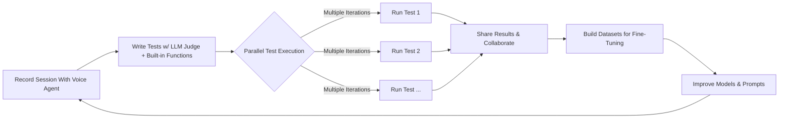

# EchoFire 

**Realistic Voice Agent Testing**  

> Automate end-to-end evaluation of voice agents with human-like audio simulation.  

### Why EchoFire?  
- 🚫 **Manual testing sucks**: Listening to every agent response isn't scalable.  
- 🤖 **Synthetic TTS isn't real**: Simulate *actual* human speech patterns, background noise, and ASR edge cases.  
- 🔥 **Test everything**: Validate ASR accuracy, intent logic, and agent responses in one flow.  
- 💻 **Works locally**: Run tests on your machine with a simple CLI - no cloud deployment needed.
- 🔄 **CI/CD ready**: Integrate voice agent testing into your continuous integration pipeline.