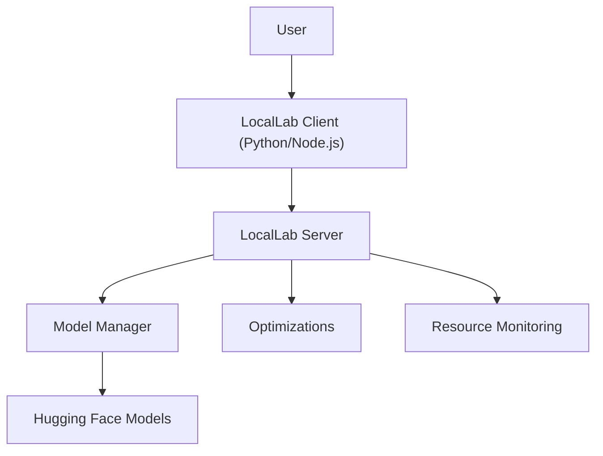
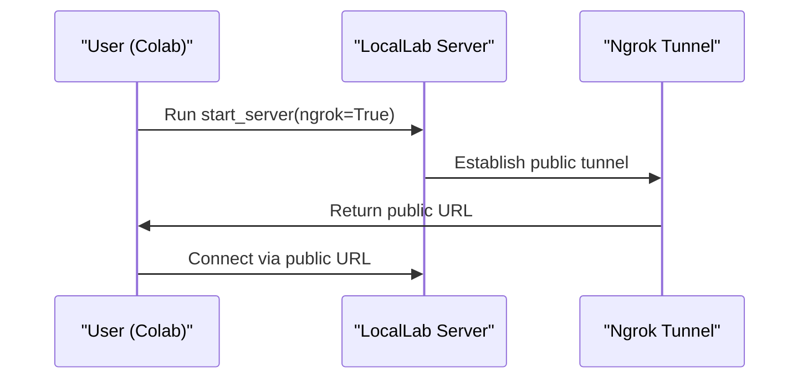

# 🚀 LocalLab: Run AI Models Easily

[](https://github.com/Developer-Utkarsh/LocalLab/actions)
[](https://pypi.org/project/locallab/)
[](https://pypi.org/project/locallab/)
[](https://github.com/Developer-Utkarsh/LocalLab/blob/main/LICENSE)

LocalLab empowers users to run any Hugging Face AI model locally or on Google Colab with minimal setup required. It automatically configures an API using ngrok, enabling seamless integration into applications from any location. Designed for simplicity, LocalLab makes advanced AI accessible to all, regardless of technical expertise. With built-in model management, performance optimizations, and system monitoring, it ensures efficient and reliable AI operations for developers, researchers, and enthusiasts alike.

> **Note**: For the latest changes and updates, please see the [CHANGELOG.md](./CHANGELOG.md) file.

## What Problem Does LocalLab Solve?

- **Local Inference:** Run advanced language models without relying on expensive cloud services.
- **Optimized Performance:** Utilize state-of-the-art techniques like quantization, attention slicing, and CPU offloading for maximum efficiency.
- **Seamless Deployment:** Easily switch between local deployment and Google Colab, leveraging ngrok for public accessibility.
- **Effective Resource Management:** Automatically monitor and manage CPU, RAM, and GPU usage to ensure smooth operation.

## System Requirements

### Minimum Requirements

| Component | Local Deployment | Google Colab           |
| --------- | ---------------- | ---------------------- |
| RAM       | 4GB              | Free tier (12GB)       |
| CPU       | 2 cores          | 2 cores                |
| Python    | 3.8+             | 3.8+                   |
| Storage   | 2GB free         | -                      |
| GPU       | Optional         | Available in free tier |

### Recommended Requirements

| Component | Local Deployment | Google Colab       |
| --------- | ---------------- | ------------------ |
| RAM       | 8GB+             | Pro tier (24GB)    |
| CPU       | 4+ cores         | Pro tier (4 cores) |
| Python    | 3.9+             | 3.9+               |
| Storage   | 5GB+ free        | -                  |
| GPU       | CUDA-compatible  | Pro tier GPU       |

## Key Features

- **Interactive CLI:** Configure and run your server with an intuitive command-line interface that adapts to your environment.
- **Multiple Model Support:** Pre-configured models along with the ability to load custom ones on demand.
- **Advanced Optimizations:** Support for FP16, INT8, and INT4 quantization, Flash Attention, and attention slicing.
- **Comprehensive Logging System:** Colorized console output with server status tracking, request monitoring, and performance metrics.
- **Robust Resource Monitoring:** Real-time insights into system performance and resource usage.
- **Flexible Client Libraries:** Comprehensive clients available for both Python and Node.js.
- **Google Colab Friendly:** Dedicated workflow for deploying via Google Colab with public URL access.
- **Persistent Configuration:** Save your settings for future use with the new configuration system.

## Unique Visual Overview

Below is a high-level diagram of LocalLab's architecture.



## Google Colab Workflow



## Documentation & Usage Guides

For full documentation and detailed guides, please visit our [documentation page](https://github.com/Developer-Utkarsh/LocalLab/blob/main/docs/README.md).

- [Getting Started Guide](https://github.com/Developer-Utkarsh/LocalLab/blob/main/docs/guides/getting-started.md)
- [CLI Guide](https://github.com/Developer-Utkarsh/LocalLab/blob/main/docs/guides/cli.md)
- [Python Client](https://github.com/Developer-Utkarsh/LocalLab/blob/main/docs/clients/python/README.md)
- [Node.js Client](https://github.com/Developer-Utkarsh/LocalLab/blob/main/docs/clients/nodejs/README.md)
- [Client Comparison](https://github.com/Developer-Utkarsh/LocalLab/blob/main/docs/clients/comparison.md)
- [Google Colab Guide](https://github.com/Developer-Utkarsh/LocalLab/blob/main/docs/colab/README.md)
- [API Reference](https://github.com/Developer-Utkarsh/LocalLab/blob/main/docs/guides/api.md)

## Get Started

1. **Installation:**

   ```bash
   pip install locallab
   ```

2. **Using the CLI (New!):**

   ```bash
   # Start the server with interactive configuration
   locallab start

   # Start with specific options
   locallab start --model microsoft/phi-2 --quantize --quantize-type int8

   # Run the configuration wizard without starting the server
   locallab config

   # Display system information
   locallab info
   ```

3. **Starting the Server Programmatically:**

   ```python
   from locallab import start_server
   start_server()
   ```

4. **Starting the Server on Google Colab:**

   ```python
   !pip install locallab

   # Set up your ngrok auth token (REQUIRED for public access)
   # Get your free token from: https://dashboard.ngrok.com/get-started/your-authtoken
   import os
   os.environ["NGROK_AUTH_TOKEN"] = "your_token_here"

   # Optional: Configure model and optimizations
   os.environ["HUGGINGFACE_MODEL"] = "microsoft/phi-2"  # Choose your preferred model
   os.environ["LOCALLAB_ENABLE_QUANTIZATION"] = "true"  # Enable model optimizations

   # Start the server with ngrok for public access
   from locallab import start_server
   start_server(use_ngrok=True)  # Creates a public URL accessible from anywhere
   ```

5. **Connecting your Client:**

   ```python
   from locallab.client import LocalLabClient

   # Use the ngrok URL displayed in the output above
   client = LocalLabClient("https://xxxx-xxx-xxx-xxx.ngrok.io")

   # Test the connection
   response = client.generate("Hello, how are you?")
   print(response)
   ```

## CLI Features (New in v0.4.8!)

LocalLab now includes a powerful command-line interface with the following features:

- **Interactive Configuration:** Guided setup for all server settings
- **Environment Detection:** Smart defaults based on your system
- **Persistent Settings:** Configuration stored in `~/.locallab/config.json`
- **System Information:** Detailed insights about your hardware
- **Performance Optimizations:** Easy configuration of quantization and other optimizations
- **Google Colab Integration:** Automatic detection and configuration for Colab environments

Example CLI usage:

```bash
# Start with interactive prompts
locallab start

# Configure with specific options
locallab start --model microsoft/phi-2 --port 8080 --quantize --attention-slicing

# Run configuration wizard
locallab config

# Check system resources
locallab info
```

## Join the Community

- Report issues on our [GitHub Issues](https://github.com/Developer-Utkarsh/LocalLab/issues).
- Participate in discussions on our [Community Forum](https://github.com/Developer-Utkarsh/LocalLab/discussions).
- Learn how to contribute by reading our [Contributing Guidelines](https://github.com/Developer-Utkarsh/LocalLab/blob/main/docs/guides/contributing.md).

---

LocalLab is designed to bring the power of advanced language models directly to your workspace—efficiently, flexibly, and affordably. Give it a try and revolutionize your AI projects!
