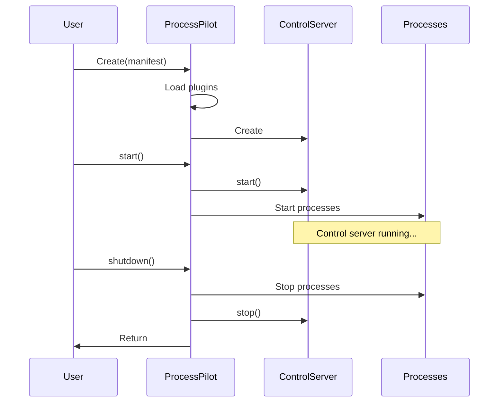
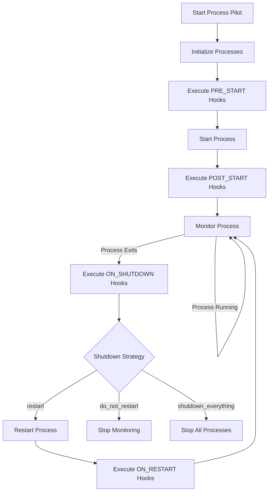
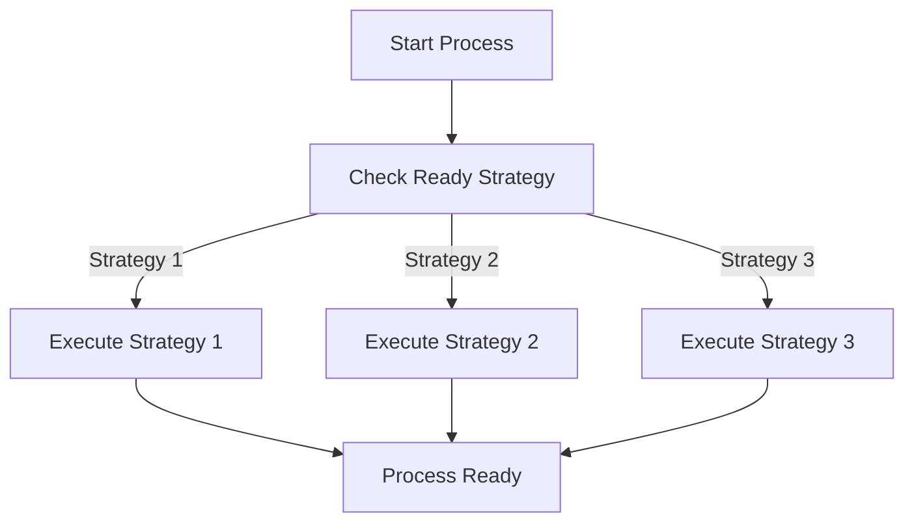
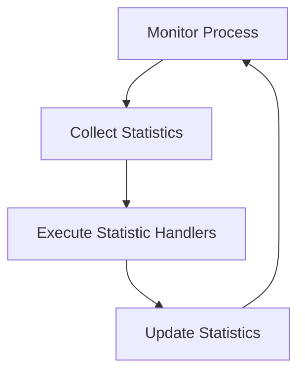
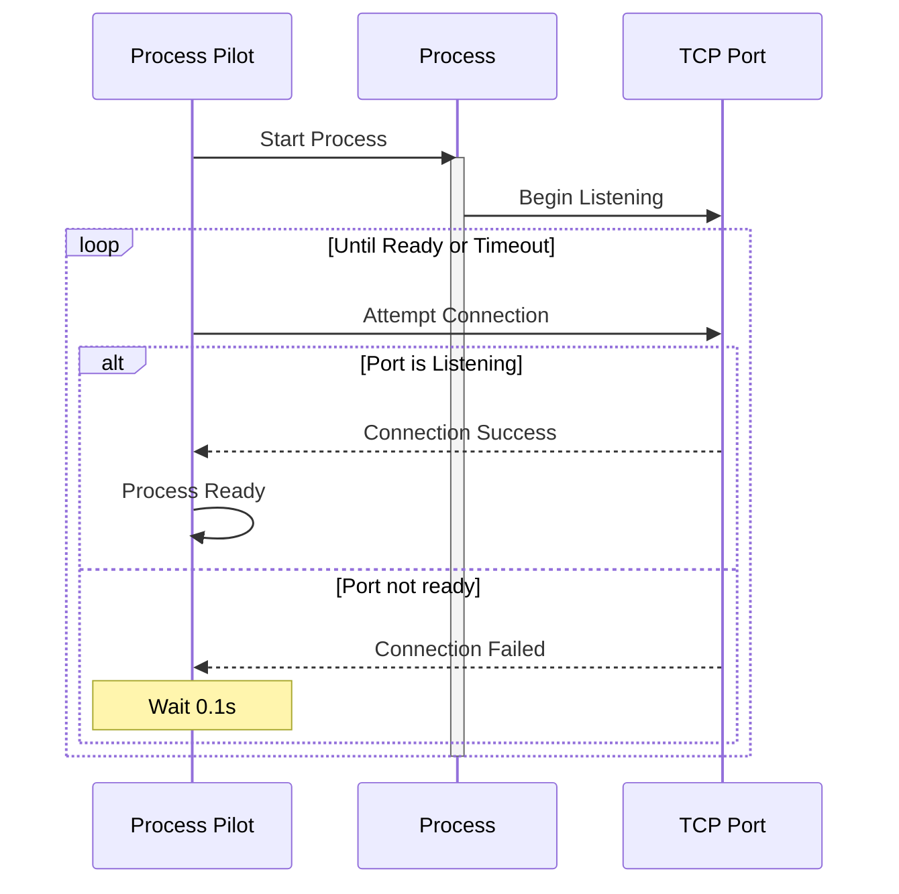
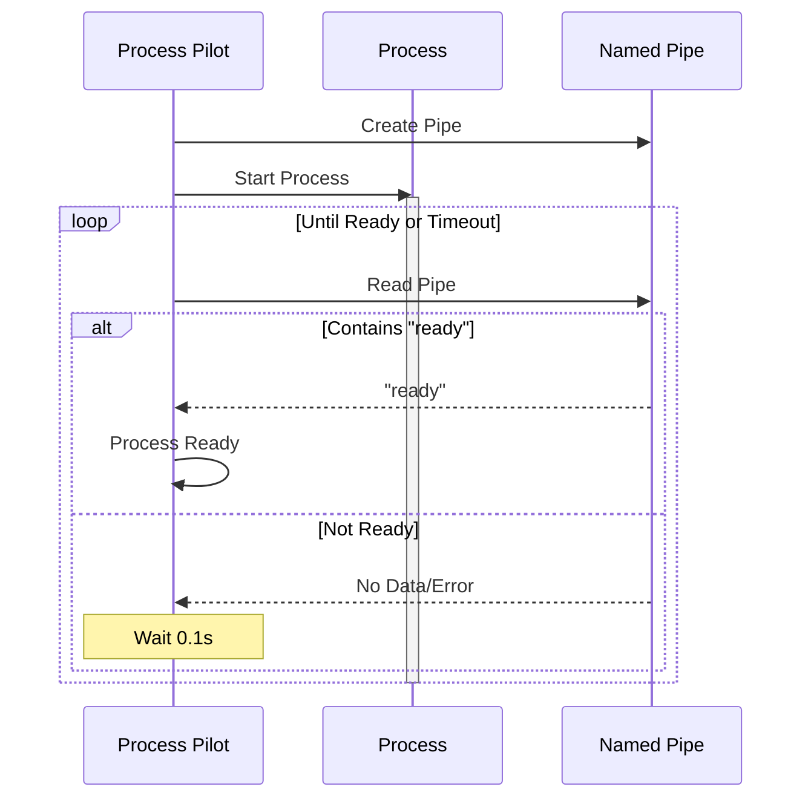
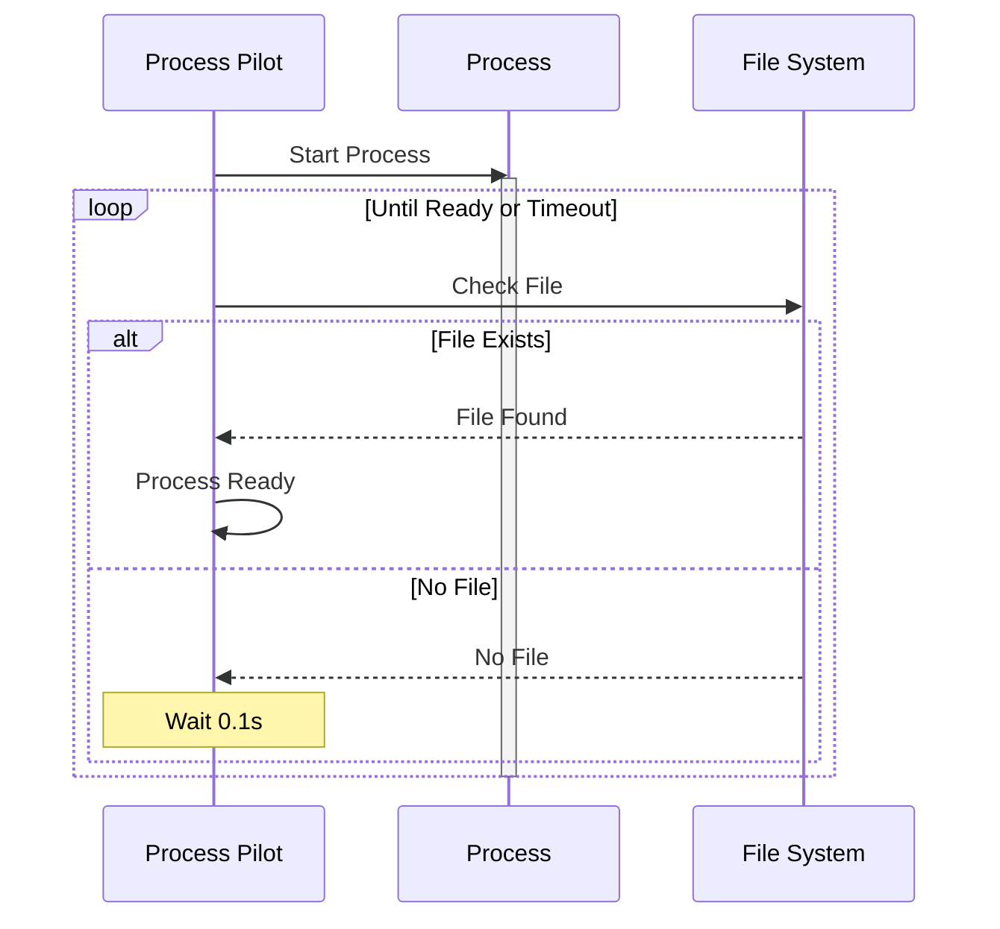

# Process Pilot

Process Pilot is a Python-based tool for managing and monitoring processes defined in a manifest file. It supports JSON and YAML formats for defining processes and their configurations.

## Features

- Load process configurations from JSON or YAML files.
- Manage process lifecycles with customizable hooks.
- Monitor process resource usage.
- Define shutdown strategies for processes.
- Define ready strategies to determine when launched processes are deemed to be "running".
- Define control servers that allow you more fine-tuned runtime control of your processes
- Set process affinities (Mac OS X not supported for this feature)

## Installation

To install the dependencies, use [uv](https://github.com/astral-sh/uv):

```sh
uv sync
```

## Usage

You can use the `ProcessPilot` class directly in your Python code to manage processes defined in a YAML or JSON file.

### Process Control

You can restart specific processes by name:

```python
from process_pilot.pilot import ProcessPilot
from process_pilot.process import ProcessManifest
from pathlib import Path

# Load manifest and start ProcessPilot
manifest = ProcessManifest.from_json(Path("manifest.json"))
pilot = ProcessPilot(manifest)
pilot.start()

# Later, restart specific processes
try:
    pilot.restart_processes(["api_server", "worker"])
except ValueError as e:
    print(f"Error restarting processes: {e}")
```

### Example Usage

#### Using a JSON Manifest

```python
from pathlib import Path
from process_pilot.process import ProcessPilot, ProcessManifest

# Load the process manifest from a JSON file
manifest_path = Path("path/to/your/manifest.json")
manifest = ProcessManifest.from_json(manifest_path)

# Create a ProcessPilot instance with the loaded manifest
pilot = ProcessPilot(manifest)

# Start managing the processes
pilot.start()
```

#### Using a YAML Manifest

```python
from pathlib import Path
from process_pilot.process import ProcessPilot, ProcessManifest

# Load the process manifest from a YAML file
manifest_path = Path("path/to/your/manifest.yaml")
manifest = ProcessManifest.from_yaml(manifest_path)

# Create a ProcessPilot instance with the loaded manifest
pilot = ProcessPilot(manifest)

# Start managing the processes
pilot.start()
```

## Configuration

### Process Manifest

The process manifest defines the processes to be managed. It can be written in JSON or YAML format.

#### Parameters

- `name`: The name of the process. This should be unique within the manifest.
- `path`: The path to the executable or script to be run.
- `args`: A list of arguments to be passed to the process.
- `timeout`: The maximum time (in seconds) to wait for the process to stop.
- `kill_timeout`: The maximum time (in seconds) to wait for a process to stop after sending a kill signal. Defaults to 5.0 seconds.
- `shutdown_strategy`: The strategy to use when shutting down the process. Possible values are:
  - `do_not_restart`: Do not restart the process after it stops.
  - `restart`: Restart the process after it stops. This is the default.
  - `shutdown_everything`: Stop all processes when this process stops.
- `ready_strategy`: The strategy to use to determine when the process is ready. Possible values are:
  - `tcp`: The process is ready when it starts listening on a specified TCP port.
  - `pipe`: The process is ready when it writes a specific signal to a named pipe.
  - `file`: The process is ready when a specific file is created.
- `working_directory`: The working directory (cwd) to use when starting the process. Defaults to the location of the executable if not provided.
- `env`: A dictionary of environment variables to set for the process.
- `affinity`: List of processor IDs (0-based) that the process should be restricted to run on. Not supported on macOS.

The following is an example of a JSON manifest:

```json
{
  "kill_timeout": 2.0,
  "processes": [
    {
      "name": "example",
      "path": "sleep",
      "args": ["5"],
      "timeout": 3,
      "shutdown_strategy": "do_not_restart",
      "ready_strategy": "tcp",
      "ready_timeout_sec": 10.0,
      "ready_params": {
        "port": 8080
      },
      "working_directory": "/path/to/working/directory",
      "env": {
        "ENV_VAR": "value"
      },
      "processor_affinity": [0, 1] // Run only on first two processors
    }
  ]
}
```

The following is an example of a YAML manifest:

```yaml
control_server: my_server
kill_timeout: 2.0
processes:
  - name: example
    path: sleep
    args: ["5"]
    timeout: 1.0
    shutdown_strategy: do_not_restart
    ready_strategy: tcp
    ready_timeout_sec: 10.0
    ready_params:
      port: 8080
    working_directory: /path/to/working/directory
    env:
      ENV_VAR: value
    processor_affinity: [0, 1] # Run only on first two processors
```

## Plugin System

Process Pilot supports a plugin system that allows users to extend its functionality with custom lifecycle hooks, ready strategies, and process statistics handlers. Each created plugin can provide all three of the aforementioned groups, or just one. Each registration function links a name to a function or set of functions. The name provided must match what is in the manifest.

### Plugin Registration Scoping

Plugins in Process Pilot have one distinct registration scope:

1. **Process-Specific Hooks**: Process lifecycle hooks, ready strategies, and process statistic handlers are only registered for processes that explicitly request them in their manifest configuration.

### Creating a Plugin

To create a plugin, define a class that inherits from `Plugin` and implement the required methods:

```python
# import statements...

class FileReadyPlugin(Plugin):
    def get_ready_strategies(self) -> dict[str, ReadyStrategyType]:
        return {
            "file": self._wait_file_ready,
        }

    def _wait_file_ready(self, process: "Process", ready_check_interval_secs: float) -> bool:
        file_path = process.ready_params.get("path")

        if not file_path:
            msg = "Path not specified for file ready strategy"
            raise RuntimeError(msg)

        file_path = Path(file_path)

        start_time = time.time()
        while (time.time() - start_time) < process.ready_timeout_sec:
            if file_path.exists():
                return True
            time.sleep(ready_check_interval_secs)
        return False
```

When creating plugins that implement a ready strategy it is important to keep in mind that you should always be checking readiness relative to the start time--and always comparing the difference to the timeout value that is specified in the manifest. The simplest example of this can be seen in the `FileReadyPlugin` shown above:

```python
start_time = time.time()
while (time.time() - start_time) < process.ready_timeout_sec:
    if file_path.exists():
        return True
    time.sleep(ready_check_interval_secs)

# Timeout
return False
```

Be careful not to use readiness checks that block the thread's ability to check for a timeout condition.

### Plugin Registration

To register a plugin, you can either provide it when creating the `ProcessPilot` instance or register it later:

```python
pilot = ProcessPilot(manifest)
pilot.register_plugins([CustomPlugin()])

# Start processes
pilot.start()
```

Or, by providing a plugin directory when the ProcessPilot object is constructed. See the API documentation for the ProcessPilot class, and the Plugin class for more details.

## Control Server Plugins

Control server plugins provide a way to add remote control capabilities to Process Pilot. A control server can be used to monitor and control processes at runtime through various interfaces (HTTP, TCP, Unix socket, etc.).

### Creating a Control Server Plugin

To create a control server plugin:

1. Create a class that implements your control server with at least these methods:

   - `__init__(self, pilot: ProcessPilot)` - Constructor that receives the pilot instance
   - `start(self)` - Called when Process Pilot starts
   - `stop(self)` - Called when Process Pilot shuts down

2. Create a plugin class that inherits from `Plugin` and registers your control server:

```python
from process_pilot.plugin import Plugin, ControlServerType
from process_pilot.pilot import ProcessPilot

class MyControlServer:
    def __init__(self, pilot: ProcessPilot):
        self.pilot = pilot

    def start(self):
        # Start your control server
        pass

    def stop(self):
        # Clean up resources
        pass

class MyControlServerPlugin(Plugin):
    def get_control_servers(self) -> dict[str, ControlServerType]:
        return {"my_server": lambda pilot: MyControlServer(pilot)}
```

3. Register your plugin and enable it in the manifest:

```python
pilot = ProcessPilot(manifest)
pilot.register_plugins([MyControlServerPlugin()])
```

```yaml
manifest:
  control_server: my_server # Enable your control server
  processes:
    # ... process definitions ...
```

### Control Server Lifecycle

The following diagram shows when the control server is started and stopped:



### Built-in Control Server Features

The ProcessPilot instance passed to the control server provides methods to:

- Start/stop/restart processes
- Get process statistics
- Access the process manifest
- Query process status

## Process Lifecycle Hooks

The following diagram illustrates the process lifecycle and when various hook functions are called:



Ready strategies tie in to this via:



Statistic handlers tie into this via:



## Ready Strategies

Process Pilot supports three different strategies to determine if a process is ready, but more strategies can be provided via plugins:

1. TCP Port Listening
2. Named Pipe Signal
3. File Presence

Each ready strategy is only relevant for determining when dependent processes should be started. That is, if a given process has no dependencies, then specifying a ready strategy isn't currently meaningful. The following diagrams illustrate how each strategy works:

### TCP Ready Strategy



### Named Pipe Ready Strategy



### File Ready Strategy



Each strategy can be configured in the manifest:

```yaml
processes:
  - name: example
    path: myapp
    ready_strategy: tcp # or "pipe" or "file"
    ready_timeout_sec: 10.0
    ready_params:
      port: 8080 # for TCP
      path: "/tmp/ready.txt" # for File
```

## Dependency Graph Visualization

Process Pilot includes a tool to visualize process dependencies using Graphviz. This helps you understand and validate the relationships between your processes.

### Prerequisites

The graph visualization requires Graphviz to be installed on your system:

```sh
# Ubuntu/Debian
apt-get install graphviz

# macOS
brew install graphviz

# Windows
choco install graphviz
```

### Generating Dependency Graphs

You can generate a dependency graph from your process manifest using the `graph.py` module:

```sh
process-graph manifest.json --format png --output-dir ./graphs
```

### Command Line Options

- manifest_path: Path to your JSON or YAML manifest file (required)
- --format: Output format (png, svg, or pdf) - defaults to png
- --output-dir: Directory to save the generated graph
- --detailed: Include detailed process information in tooltips

### Graph Features

- Process nodes with their names
- Directed edges showing dependencies
- Color-coding for ready strategies:
  - Light blue: TCP ready strategy
  - Light green: File ready strategy
  - Light yellow: Pipe ready strategy
- Detailed tooltips (when using --detailed) showing:
  - Process path
  - Ready strategy
  - Timeout values

> NOTE: Detailed output is only available when the output is SVG

### Example

```sh
process-graph manifest.json --format svg --output-dir ./graphs --detailed
```

## Development

### Running Tests

To run the tests, use:

```sh
uv run pytest
```

### Build the documentation

To build the documentation, run the following from the top level of the repository:

```sh
uv run sphinx-build -b html docs docs/_build/html
```

### Linting and Formatting

To lint and format the code, use:

```sh
uv run ruff check .
uv run autopep8 --in-place --recursive .
```

## License

This project is licensed under the MIT License. See the [LICENSE](../LICENSE) file for details.

## Contributing

Contributions are welcome! Please open an issue or submit a pull request.

## Contact

For any inquiries, please contact James Armes at jamesleearmes@gmail.com.
