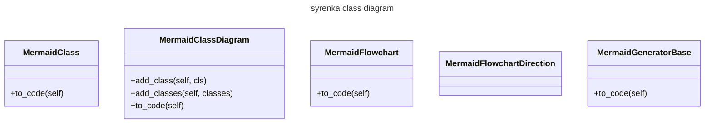

# syrenka
syrenka is mermaid.js markdown generator

## Description

The aim of this project is to provide easy to use classes for generating mermaid charts and diagrams.

## Installation

`pip install syrenka`

## Example

Here are current classes with names starting with "Mermaid" in syrenka module:



So how do we get it?
This is a code snippet that does it:

```python
import syrenka

class_diagram  = syrenka.MermaidClassDiagram("syrenka class diagram")
class_diagram.add_classes(syrenka.generate_class_list_from_module(module_name="syrenka", starts_with="Mermaid")

for line in class_diagram.to_code():
    print(line)
```

and the output:
```cmd
---
title: syrenka class diagram
---
classDiagram
    class MermaidClass{
        -cls
        -indent
        -skip_underscores
        +__init__(self, cls, skip_underscores)
        +to_code(self)
    }
    class MermaidClassDiagram{
        -title
        -classes
        +__init__(self, title)
        +add_class(self, cls)
        +add_classes(self, classes)
        +to_code(self)
    }
    class MermaidFlowchart{
        -title
        -direction
        +__init__(self, title, direction)
        +to_code(self)
    }
    class MermaidFlowchartDirection{
    }
    class MermaidGeneratorBase{
        +__init__(self)
        +to_code(self)
    }
```

ready to use mermaid markdown

