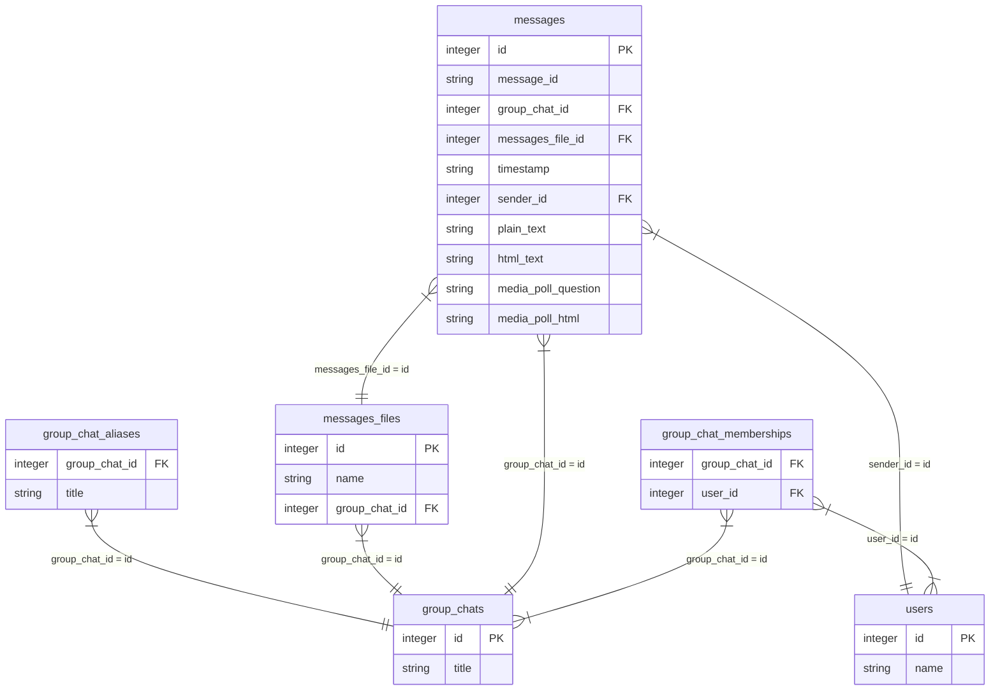

# Telegram Export Explorer

A tool for parsing and exploring exported Telegram conversations

Like many families, mine uses Telegram to keep in touch. I was worried about losing that family chat history, though. Fortunately, Telegram offers the ability to export your conversations to HTML. You can find instructions at <https://telegram.org/blog/export-and-more>.

The exported files are a bit hard to navigate and search through. I've created this project to make it easier to browse through our chat history. It finds and parses the "messages.html" files and loads them into a [SQLite](https://www.sqlite.org/) database. In the future I'd like to build a [Flask](https://flask.palletsprojects.com/en/stable/) app to make exploration even easier. Until then, I'm using [Datasette](https://datasette.io/) to browse our conversations. By using foreign keys in the database, Datasette makes navigation a breeze.

Hopefully other people can find this useful as well. If there are any features you'd like added, or bugs you'd like fixed, please file an issue in the repo. Note: If you include example data in your issue, please make sure to anonymize your example. I don't want to know what you and your family have been up to.

Warning: This project is still under very active development, and the API and database schemas will be changing. For the time being, you cannot rely on semantic versioning to keep you safe. (I'd be on release 100.0.0 by now if it were!)

### Installation

```sh
pip install telegram_export_explorer
```

## Usage

This package provides both a CLI interface and a Python library that can be used for parsing Telegram exports.

Assuming your exported chats are in `~/Downloads/my-family-chats/`, and you want to create a SQLite database called `messages.db`, you can run:

```sh
build-telegram-db ~/Downloads/my-family-chats/ messages.db
```

If you want to generate the same database from your Python code, you could use something like this:

```python
from telegram_export_explorer import build_db

build_db('~/Downloads/my-family-chats/', 'messages.db')
```

The generated database can be explored using Datasette:

```sh
datasette -o messages.db
```

## Notes

- The following messages are ignored because they don't include a timestamp
  - Voice chat-related messages
  - Pinned message notifications
  - Group photo changed
  - Group converted messages, for when a conversation is converted from one type to another
- Invitation notifications are used to populate the members of a group chat, even if the inviter and invitee never post a message in the chat. This lets you know that your Aunt Dorthy was lurking but never posted.
- Similar to invitation notifications, messages about a user joining a group record the user as a member of the group even if they never post.
- Telegram messages contain a message id. This can't be trusted to be globally unique. The "messages" table contains a unique "id" field, and the Telegram message id is stored in the "message_id" field. I suspect the combination of "group_chat_id" and "message_id" is unique, but I'm not certain.
- Message timestamps are stored in ISO-8601 format as UTC
- If text is present in a message, its original html is stored in the "html_text" field, and the plaintext is stored in the "plain_text" field
- If a message contains a poll, the question is stored in the "media_poll_question" field, and the entire poll is stored as HTML in "media_poll_html"

## To Do

- Add support for group title changes
- Add support for forwarded messages
- Add support for message replies
- Add support for media file messages
- Improve argument parsing
- Create a Flask app to make this easier to navigate

## Database Schema


